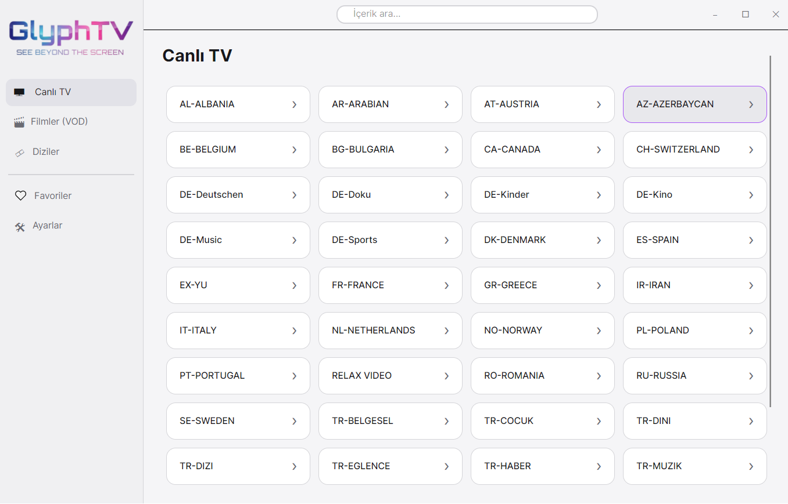
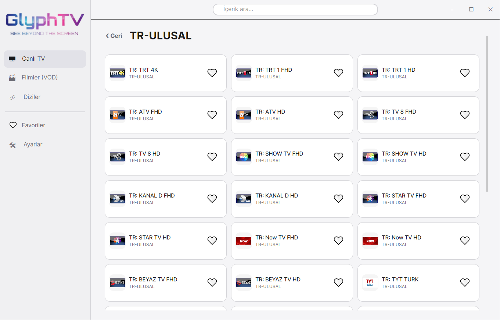
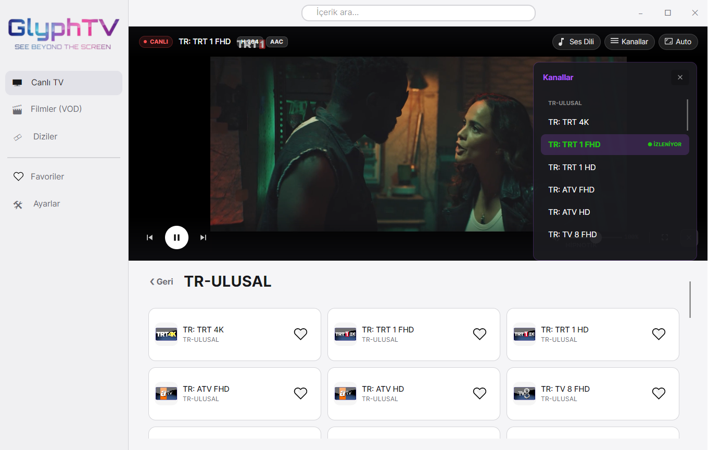
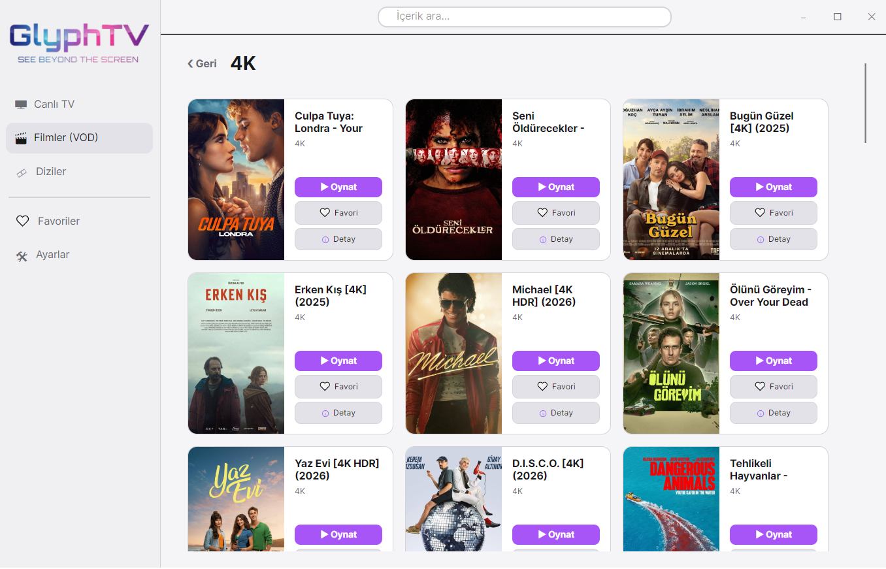
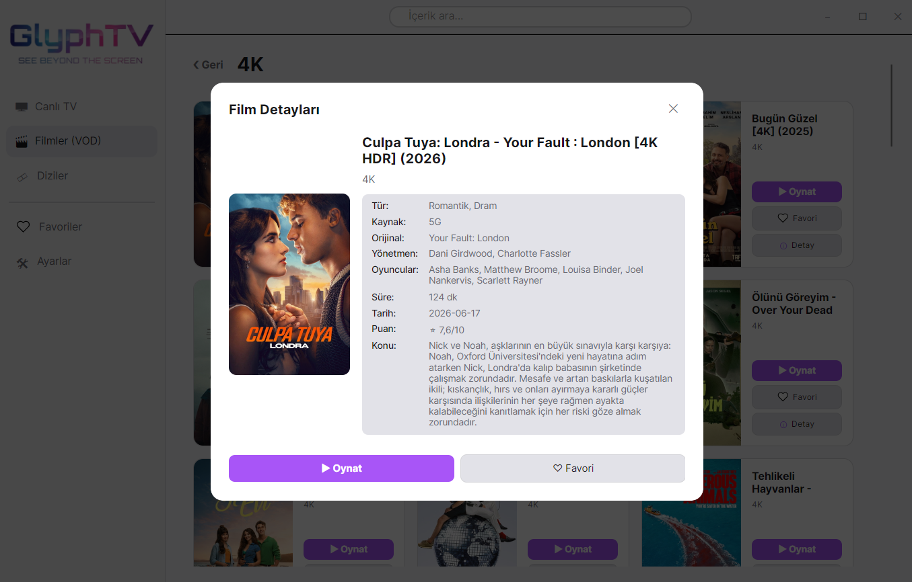
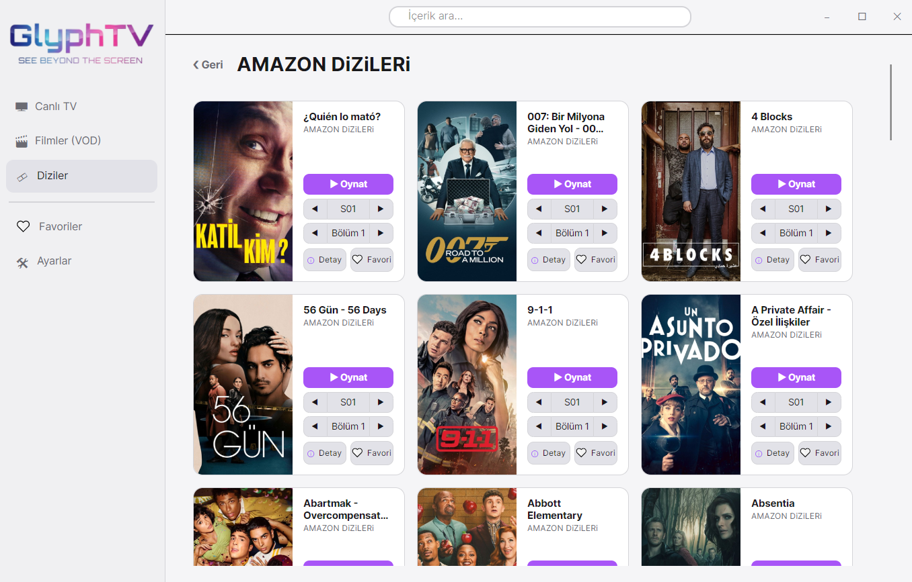
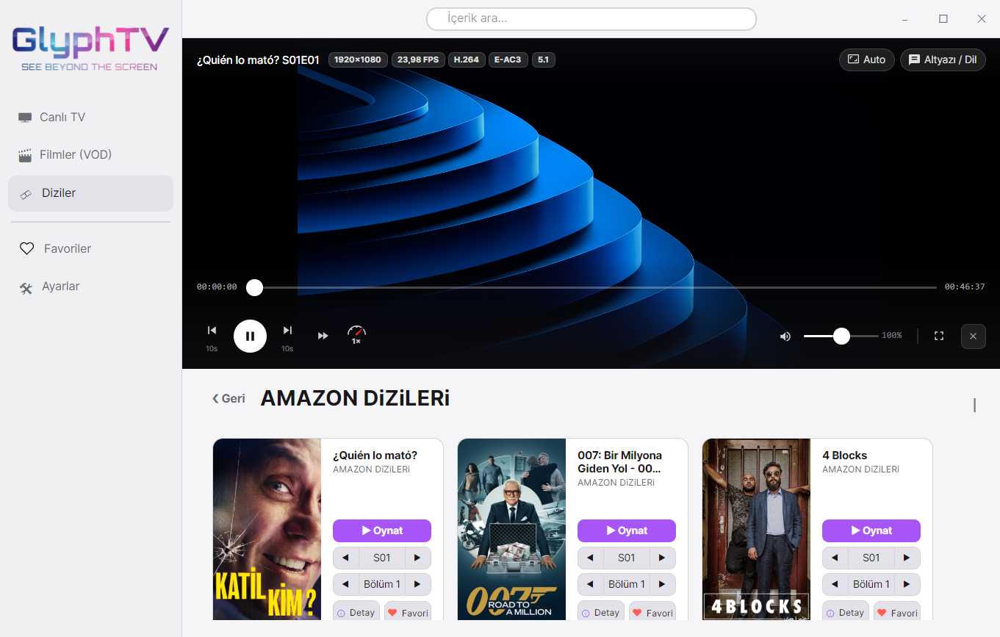
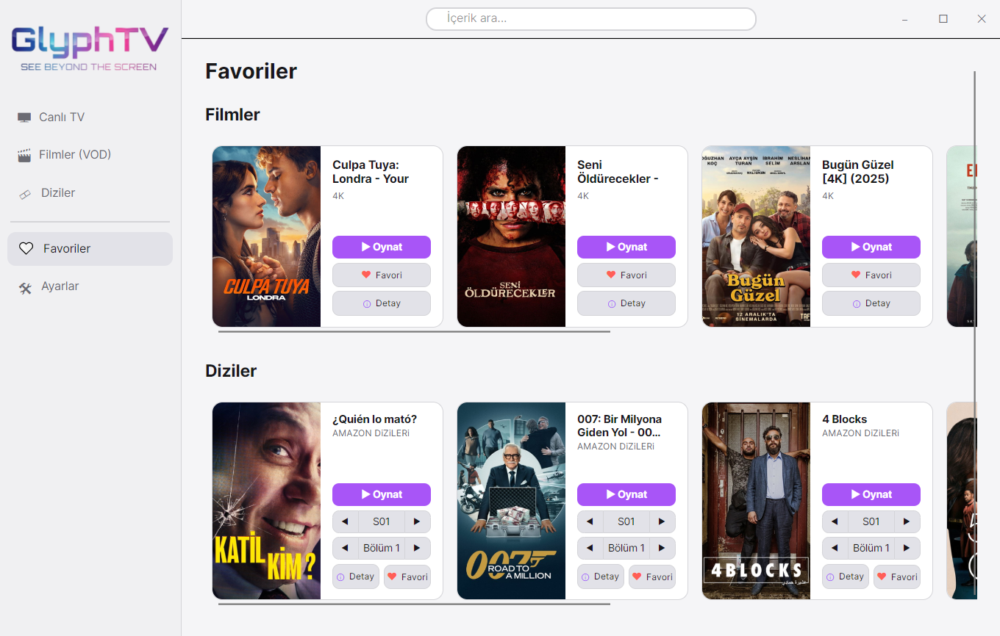
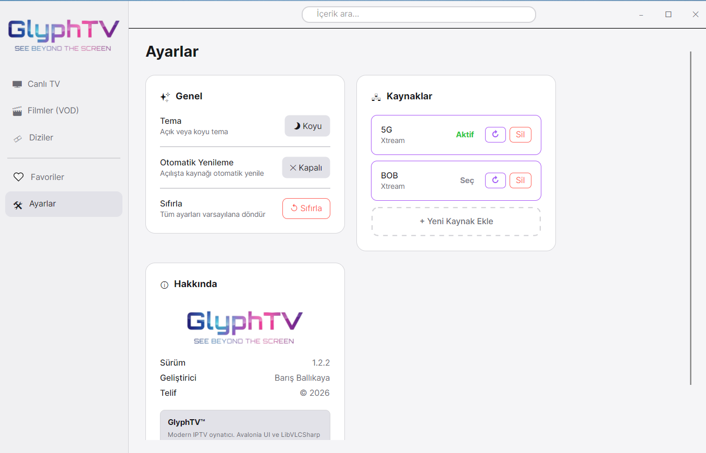

<div align="center">
  

  # GlyphTV

  Modern, hafif ve kullanımı kolay bir IPTV oynatıcı. Avalonia UI ve LibVLCSharp kullanılarak geliştirilmiştir. Çapraz platform desteği sağlar. IPTV çalma listeleri için oynatma desteği sağlar.

  
  
  
  
  

</div>

---

## Özellikler

- 📺 **Canlı TV** — M3U, Link ve Xtream Code kaynak desteği
- 🎬 **VOD (Filmler)** — Devam etme, favori ve detay modalı
- 🎞️ **Diziler** — Otomatik sezon/bölüm ayrıştırma, bölüm navigasyonu ve otomatik bölüm geçişi
- 🔍 **Arama** — Tüm içeriklerde anlık arama
- 🤍 **Favoriler** — Canlı TV, film ve diziler için ayrı favori listesi
- 🎨 **Tema** — Açık ve koyu tema desteği
- 🎥 **TMDB Entegrasyonu** — Film ve dizi posterleri, detaylı bilgi kartları
- ⏱️ **İzleme Geçmişi** — Kaldığın yerden devam etme
- ⌨️ **Klavye Kısayolları** — Boşluk, F, M, Ok tuşları ile hızlı kontrol
- 🔊 **Çoklu Ses/Altyazı** — Ses dili ve altyazı seçimi
- 📐 **En:Boy Oranı** — Özelleştirilebilir görüntü oranları

---

## Gereksinimler

- [Windows 10](https://www.microsoft.com/tr-tr/windows) veya üzeri
- [.NET 10 SDK](https://dotnet.microsoft.com/en-us/download/dotnet/10.0) (yalnızca kaynak koddan derlemek için)
- [VLC Media Player](https://www.videolan.org/vlc/) veya LibVLC kütüphanesi (NuGet ile otomatik gelir)

---

## 🔒 Güvenlik

### Windows SmartScreen Uyarısı

GlyphTV'yi indirdiğinizde Windows SmartScreen aşağıdaki gibi bir uyarı gösterebilir:

> **"Windows bilgisayarınızı korudu — Bilinmeyen yayıncı"**

**Bu uyarı neden çıkıyor?**

SmartScreen, Microsoft'ta kayıtlı bir kod imzalama sertifikası bulunmayan uygulamalara bu uyarıyı gösterir. Kod imzalama sertifikaları yıllık yüzlerce dolar maliyetindedir ve bu proje bireysel bir geliştirici tarafından ücretsiz olarak sunulmaktadır. Uygulama zararlı değildir; yalnızca henüz ticari bir sertifikaya sahip değildir.

**Nasıl çalıştırılır?**

1. Uyarı ekranında **"Daha fazla bilgi"** bağlantısına tıklayın.
2. Altta beliren **"Yine de çalıştır"** düğmesine tıklayın.
3. Uygulama normal şekilde başlayacaktır.

> ⚠️ Uygulamayı güvenli bulmuyorsanız aşağıdaki VirusTotal raporunu inceleyebilir veya kaynak kodunu doğrudan bu depodan derleyebilirsiniz.

---

### ✅ VirusTotal Taraması

Her sürüm yayınlanmadan önce VirusTotal üzerinden taranmaktadır. Sonuçları kendiniz doğrulayabilirsiniz.

**Neden false positive alabilirsiniz?**

Antivirüs yazılımları bazen aşağıdaki nedenlerle yanlış alarm üretebilir:

- Uygulama **self-contained** olarak paketlenmiştir — .NET runtime ve tüm bağımlılıklar tek `.exe` içinde sıkıştırılmıştır.
- **LibVLC** (`libvlc.dll`, `libvlccore.dll`) medya oynatma için native C++ kütüphaneleri içerir.
- İmzasız bir çalıştırılabilir dosya olması bazı sezgisel (heuristic) tarayıcıları tetikler.

> Şüpheniz varsa kaynak kodunu bu depodan indirip kendiniz derleyebilirsiniz. Derleme talimatları aşağıda mevcuttur.

| Alan | Detay |
|------|-------|
| Sürüm | v1.2.2 |
| Dosya | GlyphTV.exe |
| SHA256 | *(sürüm notlarında belirtilmiştir)* |
| Sonuç | 0 / 72 tespit |
| Rapor | *(sürüm notlarındaki bağlantıya bakın)* |

---

## Kurulum

### Hazır Binary (Önerilen)

1. [Releases](https://github.com/brsbllky/GlyphTV/releases) sayfasından en güncel sürümü indirin.
2. `GlyphTV.exe` dosyasını çalıştırın — kurulum gerekmez.

### Kaynak Koddan Derleme

> **TMDB API Key Gereklidir** — Poster ve film/dizi bilgileri için [themoviedb.org](https://www.themoviedb.org) adresinden ücretsiz bir API key alın. Aldığınız key'i `MainWindow.axaml.cs` dosyasındaki şu satıra girin:

```csharp
private const string TMDB_API_KEY = "buraya_api_keyinizi_girin";
```

> Key girilmezse uygulama çalışmaya devam eder; yalnızca poster ve detay bilgileri görüntülenmez.

```bash
git clone https://github.com/brsbllky/GlyphTV.git
cd GlyphTV
dotnet publish -c Release
```

Derlenen çıktı `bin/Release/net10.0-windows/publish/` klasöründe oluşacaktır.

---

## Kullanım

### Kaynak Ekleme

1. Sol menüden **Ayarlar → Kaynaklar → Yeni Kaynak Ekle**'ye tıklayın.
2. Kaynak türünü seçin:
   - **M3U** — Yerel `.m3u` / `.m3u8` dosyası
   - **Link** — M3U playlist URL'si
   - **Xtream Code** — Sunucu adresi, kullanıcı adı ve şifre

### Klavye Kısayolları

| Tuş | İşlev |
|-----|-------|
| `Space` | Oynat / Duraklat |
| `F` | Tam ekran |
| `Esc` | Tam ekrandan çık |
| `M` | Sesi kapat / aç |
| `← →` | 10 saniye geri / ileri (VOD) |
| `↑ ↓` | Önceki / sonraki kanal (Canlı TV) |

---

## Teknolojiler

| Teknoloji | Versiyon | Kullanım Amacı |
|-----------|----------|----------------|
| [Avalonia UI](https://avaloniaui.net/) | 11.3.13 | Arayüz çerçevesi |
| [LibVLCSharp](https://github.com/videolan/libvlcsharp) | 3.9.6 | Video oynatma |
| [TMDB API](https://www.themoviedb.org/documentation/api) | v3 | Film/dizi bilgileri |
| [.NET](https://dotnet.microsoft.com/) | 10 | Uygulama çerçevesi |

---

## Ekran Görüntüleri

**Canlı TV — Kategori Listesi**


**Canlı TV — Kanal Listesi**


**Canlı TV — Player & Kanal Paneli**


**Filmler (VOD)**


**Film Detay Modalı**


**Diziler**


**Dizi Player**


**Favoriler**


**Ayarlar**


---

<div align="center">

GlyphTV — Avalonia UI & LibVLCSharp ile geliştirilmiştir.

**Designed by AkuLaTa**

> 📌 Not: GlyphTV herhangi bir çalma listesi veya dijital içerik sağlamaz. Ekran görüntülerindeki kanallar ve fotoğraflar sadece gösterim amaçlıdır.

</div>
