<div align="center">


# GlyphTV 📺

**Modern, yüksek performanslı ve çift oynatıcı motorlu (MPV & VLC) IPTV / Medya Oynatıcı**  
Avalonia UI ve .NET 10 mimarisiyle geliştirilmiş, akıcı ve zengin özellikli masaüstü deneyimi.

[](https://docs.microsoft.com/en-us/dotnet/csharp/)
[](https://dotnet.microsoft.com/)
[](https://avaloniaui.net/)
[](https://mpv.io/)
[](https://www.videolan.org/vlc/)
[](https://t.me/glyphtv)
[](LICENSE)
[](https://www.microsoft.com/windows)

</div>

---

## 🚀 v2.0 ile Gelen Öne Çıkan Yenilikler

- ⚡ **Çift Oynatıcı Motoru (MPV & LibVLC Engine)** — Ultra düşük gecikmeli, donanım hızlandırmalı (D3D11VA, NVDEC, VAAPI) **MPV Oynatıcısı** entegre edildi. Kanal geçişlerinde önceki kare patlaması (ghosting) ve donmalar giderildi.
- 🌟 **Anasayfa & Akıllı TMDb Trend Hero Banner** — Otomatik geçişli, yüksek çözünürlüklü backdrop ve çift yönlü karartma gradyanına sahip dinamik popüler vitrin; Levenshtein ve yıl bazlı akıllı eşleştirme algoritması sayesinde çalma listesinde bulunmayan popüler içerikler için dahi doğrudan zengin TMDb detayları (orijinal afiş, konu, oyuncular).
- ⏱️ **Gerçek Zamanlı "Devam Et" Motoru** — Film ve dizi bölümleri için izleme süresi ve ilerleme takibi; oynatıcı kapandığı anda sekme değiştirmeye gerek kalmadan anında güncellenen izleme geçmişi.
- 📅 **Yenilenen EPG (Elektronik Program Rehberi) Modalı** — Canlı yayın ilerleme çubuğu, anlık yayın durumu, günlük yayın akış çizelgesi ve tek tıkla kanala geçiş.
- 🚀 **Sanallaştırılmış Liste Düzeni (UI Virtualization)** — Canlı TV, VOD ve Dizi listelerinde binlerce içerik olsa dahi %100 CPU sıçramalarını engelleyen, pürüzsüz kaydırma ve kategori konumu koruma sistemi.
- 🎬 **Modern Kart Formunda VOD & Dizi Detay Modalı** — Arka plan afiş silüeti (`VodInfoBackdropImage`), zıplamayan sabit kapatma butonu, hiyerarşik sezon/bölüm seçici ve TMDb metaverileri.
- ⚙️ **Bağımsız Ayarlar Overlay Modalı (`SettingsModalOverlay`)** — Sekmeden bağımsız üst katman penceresi; her açılışta doğrudan "Kaynaklar" sekmesiyle başlayan, arka plandaki yayını kesmeden kaynak yönetimi, Xtream abonelik bitiş tarihi (`exp_date`), MPV/VLC motor tercihleri ve önbellek kontrolü.
- 🎨 **Midnight Navy & Mavi Vurgu Teması** — Modern koyu lacivert renk paleti, mavi vurgu tonları ve dinamik tema uyumlu açılır menüler.

---

## ✨ Özellikler

- 📺 **Canlı TV** — M3U dosyası, M3U playlist URL'si ve Xtream Code API desteği
- 🎬 **VOD (Filmler)** — TMDb afişleri, fragmanlar, oyuncu kadrosu, devam etme ve favori yönetimi
- 🎞️ **Diziler** — Otomatik sezon/bölüm ayrıştırma, bölüm küçük resimleri ve açıklamaları ile gelişmiş navigasyon
- 📅 **EPG Program Rehberi** — XMLTV desteği, canlı yayın ilerleme yüzdesi ve detaylı program akışı
- 🔍 **Anlık Arama & Akıllı Navigasyon** — Sonuçlara odaklanan dinamik arama görünümü (Hero gizleme), menü sekme geçişlerinde otomatik temizleme ve A-Z / Z-A / Son Eklenenler filtreleri
- ❤️ **Favoriler** — Canlı TV, film ve diziler için anında güncellenen favori listesi
- 🎨 **Dinamik Tema** — Koyu (Midnight Navy) ve Açık tema desteği
- 🎥 **TMDb Entegrasyonu** — Otomatik isim temizleme, Levenshtein benzerlik doğrulaması, afiş/backdrop önbellekleme ve manuel geçersiz kılma (`tmdb-overrides.json`)
- ⏱️ **İzleme Geçmişi** — Kaldığın yerden devam etme, yüzde barı ve tek tıkla geçmişi temizleme
- ⌨️ **Klavye Kısayolları** — Boşluk, F, M, yön tuşları ile tam kontrollü oynatıcı
- 🔊 **Çoklu Ses & Altyazı** — Dil seçimi, altyazı senkronizasyonu ve 5.1 ses desteği
- 📐 **Dinamik En-Boy Oranı** — 16:9, 4:3, 21:9 ve Auto (Dinamik En:Boy) seçenekleri

---

## 💻 Gereksinimler

- [Windows 10](https://www.microsoft.com/tr-tr/windows) / Windows 11 (64-bit)
- [.NET 10 SDK](https://dotnet.microsoft.com/en-us/download/dotnet/10.0) *(yalnızca kaynak koddan derlemek için)*
- [MPV](https://mpv.io/) veya [LibVLCSharp](https://github.com/videolan/libvlcsharp) kütüphaneleri *(Uygulama ile birlikte otomatik gelir)*

---

## 🔒 Güvenlik

### Windows SmartScreen Uyarısı

GlyphTV'yi indirdiğinizde Windows SmartScreen aşağıdaki gibi bir uyarı gösterebilir:

> **"Windows bilgisayarınızı korudu — Bilinmeyen yayıncı"**

**Bu uyarı neden çıkıyor?**

SmartScreen, Microsoft'ta kayıtlı ticari bir kod imzalama sertifikası bulunmayan açık kaynaklı uygulamalara bu uyarıyı gösterir. Kod imzalama sertifikaları yüksek maliyetlidir ve bu proje topluluk için ücretsiz ve açık kaynaklı olarak sunulmaktadır. Uygulama zararlı değildir.

**Nasıl çalıştırılır?**

1. Uyarı ekranında **"Daha fazla bilgi"** bağlantısına tıklayın.
2. Altta beliren **"Yine de çalıştır"** düğmesine tıklayın.
3. Uygulama normal şekilde başlayacaktır.

> ⚠️ Uygulamayı çalıştırmadan önce aşağıdaki VirusTotal raporunu inceleyebilir veya kaynak kodunu doğrudan bu depodan derleyebilirsiniz.

---

### ✅ VirusTotal Taraması

Her sürüm yayınlanmadan önce VirusTotal üzerinden taranmaktadır. Sonuçları kendiniz doğrulayabilirsiniz.

**Neden false positive alınabilir?**

Antivirüs yazılımları bazen aşağıdaki nedenlerle yanlış alarm üretebilir:

- Uygulama **self-contained** olarak paketlenmiştir — .NET runtime ve tüm bağımlılıklar tek `.exe` içinde sıkıştırılmıştır.
- **LibVLC** ve **MPV** (`mpv-2.dll`, `libvlc.dll`, `libvlccore.dll`) medya oynatma için yerel (native) C/C++ kütüphaneleri içerir.
- İmzasız bir çalıştırılabilir dosya olması bazı sezgisel (heuristic) tarayıcıları tetikleyebilir.

| Alan | Detay |
|------|-------|
| Sürüm | v2.0.0 |
| Dosya | GlyphTV.exe |
| SHA256 | 8f866c0d390a05dfc68a270045bd5cc1c19a89df1f13903e1ec5b8d90a36b059 |
| Sonuç | 0/68 tespit | 
| Rapor | https://www.virustotal.com/gui/file/8f866c0d390a05dfc68a270045bd5cc1c19a89df1f13903e1ec5b8d90a36b059?nocache=1 |

---

## 📥 Kurulum

### Hazır Binary (Önerilen)

1. [Releases](https://github.com/brsbllky/GlyphTV/releases) sayfasından en güncel sürümü indirin.
2. `GlyphTV.exe` dosyasını çalıştırın — ek kurulum gerekmez.

### Kaynak Koddan Derleme

> **TMDb API Key (Opsiyonel ama Önerilen)** — Poster ve film/dizi metaverileri için [themoviedb.org](https://www.themoviedb.org) adresinden ücretsiz bir API key alarak Ayarlar penceresinden girebilirsiniz.

```bash
# Depoyu klonlayın
git clone https://github.com/brsbllky/GlyphTV.git
cd GlyphTV/GlyphTV

# Projeyi derleyin ve yayınlayın
dotnet publish -c Release
```

Derlenen çıktı `bin/Release/net10.0-windows/publish/` klasöründe oluşacaktır.

---

## 🎮 Kullanım

### Kaynak Ekleme

1. Üst menüden **Ayarlar (⚙️) → IPTV Kaynakları → Yeni Kaynak Ekle** adımlarını izleyin.
2. Kaynak türünü belirleyin:
   - **Xtream Code** — Sunucu adresi, kullanıcı adı ve şifre (Şifre gizle/göster desteği mevcuttur)
   - **M3U Link** — Uzak M3U/M3U8 playlist URL'si
   - **M3U Dosyası** — Yerel `.m3u` / `.m3u8` dosyası

### ⌨️ Klavye Kısayolları

| Tuş | İşlev |
|-----|-------|
| `Space` | Oynat / Duraklat |
| `F` | Tam Ekran Aç / Kapat |
| `Esc` | Tam Ekrandan Çık / Modalı Kapat |
| `M` | Sesi Kapat / Aç (Mute) |
| `← / →` | 10 saniye geri / ileri sarma (VOD & Dizi) |
| `↑ / ↓` | Önceki / sonraki kanala geçiş (Canlı TV) |
| `Çift Tık` | Video yüzeyinde Tam Ekran geçişi |

---

## 🛠️ Teknolojiler

| Teknoloji | Versiyon | Kullanım Amacı |
|-----------|----------|----------------|
| [Avalonia UI](https://avaloniaui.net/) | 11.3.13 | Modern XAML tabanlı masaüstü arayüz çerçevesi |
| [MPV Engine](https://mpv.io/) | Native | Ultra düşük gecikmeli, donanım hızlandırmalı video oynatıcı motoru |
| [LibVLCSharp](https://github.com/videolan/libvlcsharp) | 3.9.6 | Geniş codec uyumluluğuna sahip alternatif video motoru |
| [TMDb API](https://www.themoviedb.org/documentation/api) | v3 | Film/dizi afişleri, özetler ve oyuncu kadrosu |
| [.NET](https://dotnet.microsoft.com/) | 10 | Yüksek performanslı uygulama çatısı (C# 13) |

---

## 📸 Ekran Görüntüleri

> 📌 **Not**: GlyphTV herhangi bir çalma listesi veya dijital yayın içeriği barındırmaz ve sağlamaz. Ekran görüntülerindeki kanallar ve görseller sadece arayüz gösterimi amaçlıdır.

**Anasayfa & TMDb Hero Banner**  
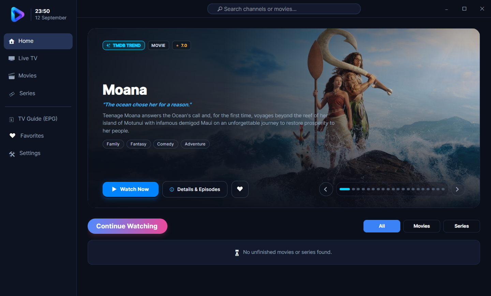

**Bağımsız Ayarlar Modalı**  
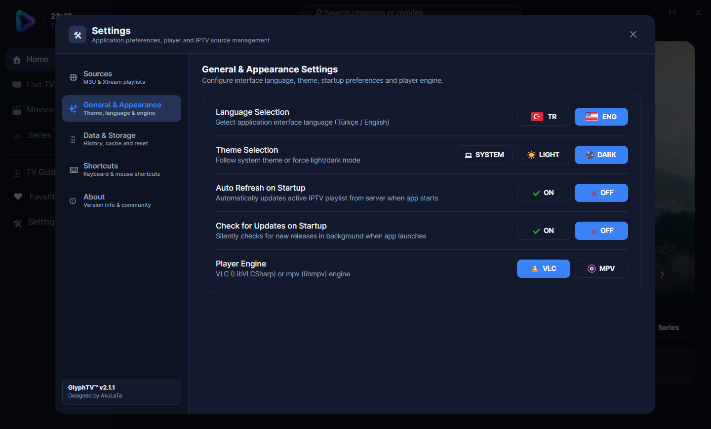

**Canlı TV — Kategori & Kanal Listesi**  
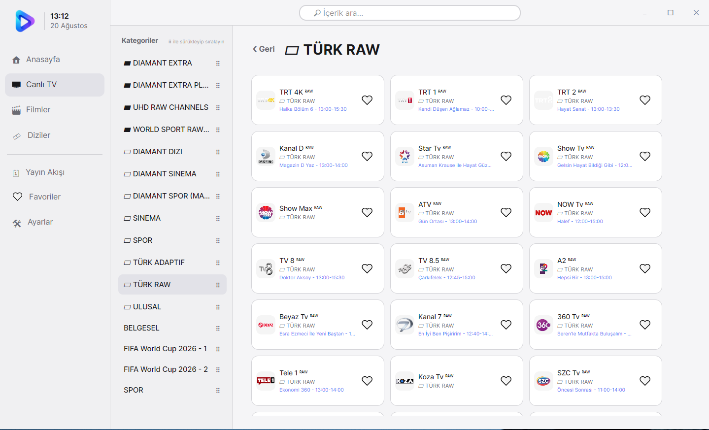
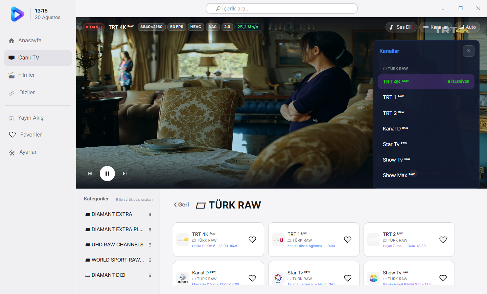

**Filmler & Diziler Kataloğu**  
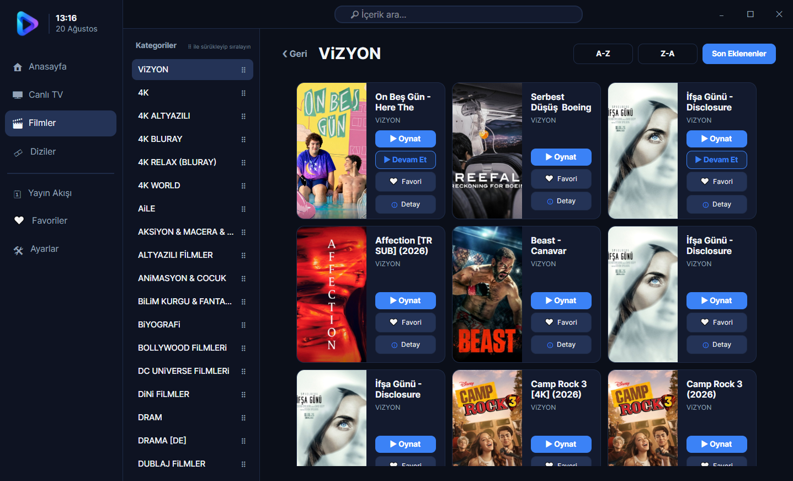
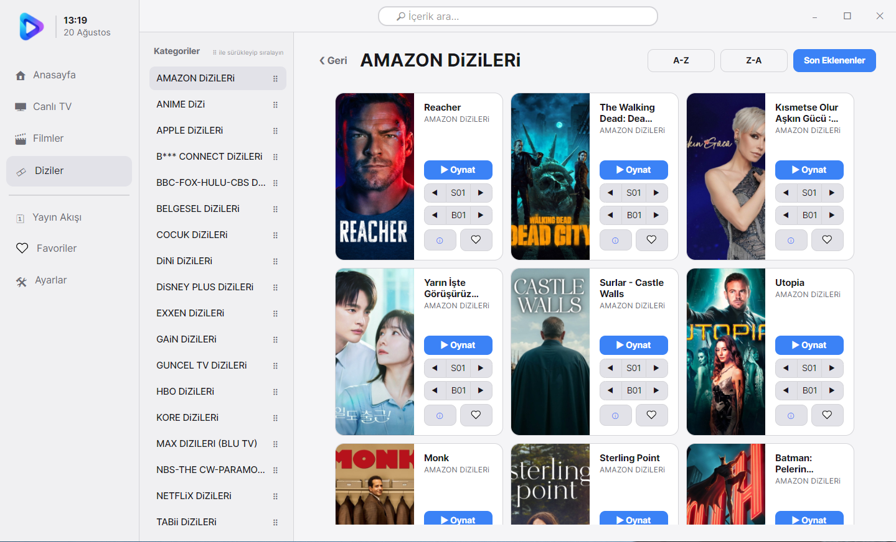

**Minimalist Film & Dizi Detay Modalı**  
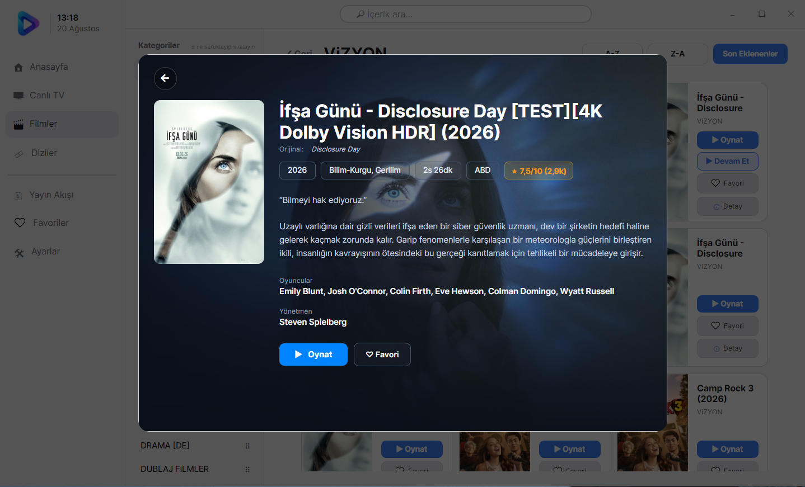

**Canlı TV — EPG Yayın Akışı Modalı**  
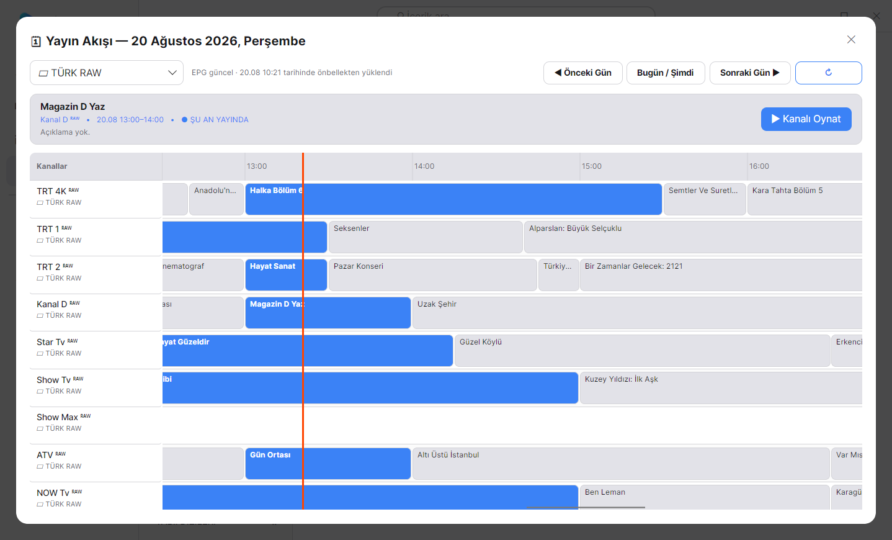

**Video Oynatıcı (Player Overlay)**  
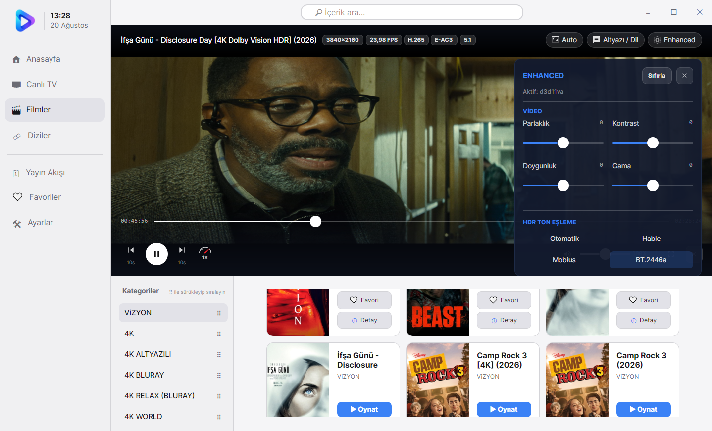

**Favoriler Sekmesi **  
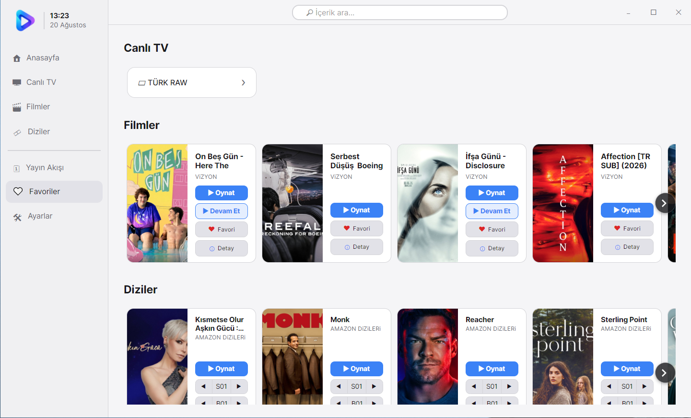

**Arama Deneyimi**  
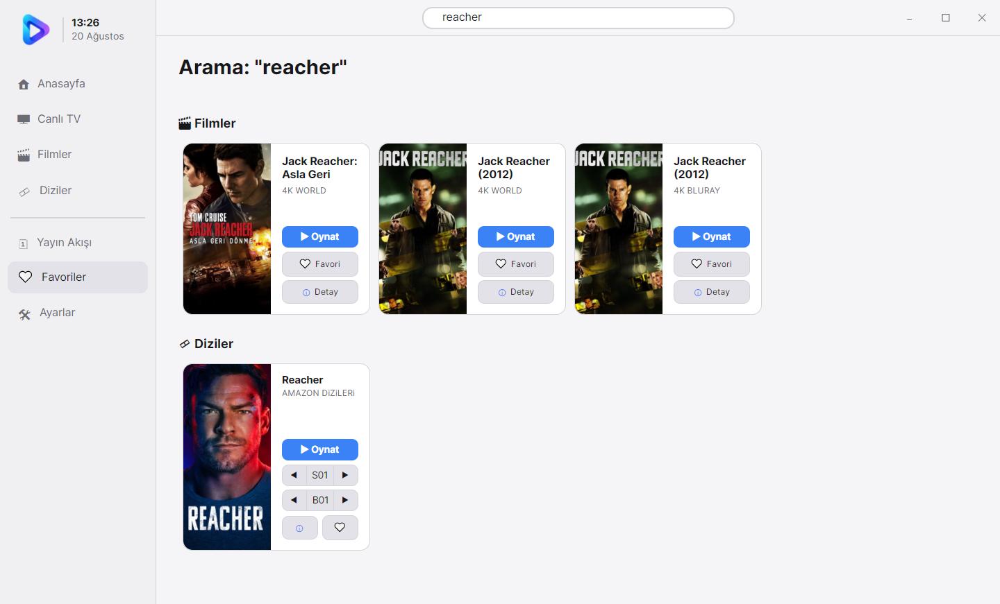

---

<div align="center">

GlyphTV — Avalonia UI, MPV & LibVLCSharp ile geliştirilmiştir.

**Designed by AkuLaTa**

</div>
